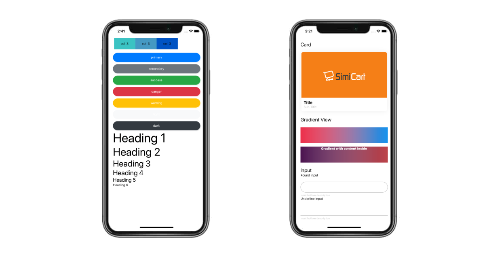

# reactnative-ui-bootstrap
<p align="center">
Apply bootstrap style like website to your react-native project. Easy use for developers move from web-development to react-native development. Ready-made components help you save time in styling components. Enjoy!
</p>
<p align="center">
  
</p>
  
  
## Installation

Easy installation.

```bash
npm install reactnative-ui-bootstrap
```

## Usage
If you are new in web-development, please see [Bootstrap Documents](https://getbootstrap.com/docs/4.0/layout/overview/). If you've already have experience in web-development, please Enjoy!

| Support Class                    |               Breakpoint Support                | Support Class                    |               Breakpoint Support                |
| -------------------------------- | :---------------------------------------------: | -------------------------------- | :---------------------------------------------: |
| ``row``                          | ``md`` and ``lg``                               |``d-block``                       | ``md`` and ``lg``                               |
| ``col``                          | ``md`` and ``lg``                               |``d-none``                        | ``md`` and ``lg``                               |
| ``col-2``                        | ``md`` and ``lg``                               |``badge``                         | no support .                                    |
| ``col-3``                        | ``md`` and ``lg``                               |``badge-primary``                 | no support .                                    |
| ``col-4``                        | ``md`` and ``lg``                               |``badge-secondary``               | no support .                                    |
| ``col-6``                        | ``md`` and ``lg``                               |``badge-success``                 | no support .                                    |
| ``col-8``                        | ``md`` and ``lg``                               |``badge-danger``                  | no support .                                    |
| ``col-9``                        | ``md`` and ``lg``                               |``badge-warning``                 | no support .                                    |
| ``col-12``                       | ``md`` and ``lg``                               |``badge-info``                    | no support .                                    |
| ``offset-1``                     | ``md`` and ``lg``                               |``badge-light``                   | no support .                                    |
| ``offset-2``                     | ``md`` and ``lg``                               |``badge-dark``                    | no support .                                    |
| ``offset-3``                     | ``md`` and ``lg``                               |``badge-light``                   | no support .                                    |
| ``offset-4``                     | ``md`` and ``lg``                               |``card-title``                    | no support .                                    |
| ``offset-5``                     | ``md`` and ``lg``                               |``card-subtitle``                 | no support .                                    |
| ``offset-6``                     | ``md`` and ``lg``                               |``align-items-start``             | no support .                                    |
| ``offset-7``                     | ``md`` and ``lg``                               |``align-items-center``            | no support .                                    | 
| ``offset-8``                     | ``md`` and ``lg``                               |``align-items-end``               | no support .                                    | 
| ``offset-9``                     | ``md`` and ``lg``                               |``align-self-start``              | no support .                                    |
| ``offset-10``                    | ``md`` and ``lg``                               |``align-self-center``             | no support .                                    | 
| ``offset-11``                    | ``md`` and ``lg``                               |``align-self-end``                | no support .                                    | 

``md`` for break point when device width value is greater 576 and less or equal 768.
<br/>
``lg`` for break point when device width value is greater 768.

<b>How to use class.</b>

```javascript
import {Div} from 'reactnative-ui-bootstrap'

...
      return(
        <Div className={'row'}>
          <Div className={'col-6 col-md-9'}>
            ...Some content here
          </Div>
        </Div>
      )
...
```

## Components

Some component in <b>reactnative-ui-bootstrap</b>:

* Div
* Button
* Card
* Input
* Gradient
* A
* P
* AnimatedView
* Popup

### Default color
``
'PRIMARY' : '#007bff'
``
<br/>
``
'SECONDARY' : '#6c757d'
``
<br/>
``
'SUCCESS' : '#28a745'
``
<br/>
``
'DANGER' : '#dc3545'
``
<br/>
``
'WARNING' : '#ffc107'
``
<br/>
``
'INFOR' : '#17a2b8'
``
<br/>
``
'LIGHT' : '#f8f9fa'
``
<br/>
``
'DARK' : '#343a40'
``

### Div
Has all default props of `View` Component.

| Prop           |     Default     |   Type   | Description                                                                                                 |
| :------------- | :-------------: | :------: | :---------------------------------------------------------------------------------------------------------- |
| className     |      ""       |  `string`  | Apply Bootstrap file by apply classes above. Separate by <b>space</b>. |

### Button
Has all default props of `Button` Component.

| Prop           |     Default     |   Type   | Description                                                                                                 |
| :------------- | :-------------: | :------: | :---------------------------------------------------------------------------------------------------------- |
| className     |      ""       |  `string`  | Apply Bootstrap file by apply classes above. Separate by <b>space</b>. |
| type     |      "primary"       |  `string`  | Apply Bootstrap button color by <b>default color</b>. |
| loadingColor     |      "white"       |  `string`  | Spinner color. |
| backGround     |      null       |  `string`  | Custom background color. |
| disabled     |      false       |  `boolean`  | Set to ``true`` to disable button. |
| radius     |      0       |  `number`  | Custom button radius. |
| uppercase     |      false       |  `boolean`  | Set to ``true`` to set uppercase text in inside. |
| lowercase     |      false       |  `boolean`  | Set to ``true`` to set lowercase text in inside. |
| capitalize     |      false       |  `boolean`  | Set to ``true`` to set capitalize text in inside. |
| loading     |      false       |  `boolean`  | Set to ``true`` to show loading. |
| shadow     |      false       |  `boolean`  | Set to ``true`` to enable button shadow. |
| shadowColor     |      null       |  `string`  | Custom button shadow color. |
| shadowElevation     |      false       |  `number`  | Custom button shadow elevation. |
| shadowWidth     |      null       |  `number`  | Custom button shadow width. |
| shadowHeight     |      false       |  `number`  | Custom button shadow height. |
| shadowOpacity     |      null       |  `number`  | Custom button shadow opacity. |
| shadowRadius     |      null       |  `number`  | Custom button shadow radius. |
| round     |      false       |  `boolean`  | Change button style to round. |
| transparent     |      false       |  `boolean`  | Change button style to transparent. |
| onlyIcon     |      false       |  `boolean`  | Display only icon in button. |
| loadingSize     |      "small"       |  `string`  | Size of loading in button: ``small``, ``large`` or number |
| opacity     |      0.8      |  `number`  | Opacity when click into button. |
| icon     |      null      |  `string`  | Name of the icon. |
| iconSize     |      14      |  `number`  | Size of the icon. |
| iconFamily     |      null      |  `string`  | Font family of the icon. |
| textStyle     |      {}      |  `any`  | Style apply to content inside. |
| full     |      false      |  `boolean`  | Button show full width. |

### Card
Has all default props of `View` Component.

| Prop           |     Default     |   Type   | Description                                                                                                 |
| :------------- | :-------------: | :------: | :---------------------------------------------------------------------------------------------------------- |
| className     |      ""       |  `string`  | Apply Bootstrap file by apply classes above. Separate by <b>space</b>. |
| imageHeader     |     false       |  `boolean`  | Apply image to top of card. Only visible when prop `imageHeaderSource` has value and this set to `true`  |
| imageHeaderSource     |      null       |  `string`  | Image header source. |
| imageHeaderHeight     |      200       |  `number`  | Image header height. |
| styleImageHeader     |      {}       |  `any`  | Image header custom style. |
| imageBottom     |     false       |  `boolean`  | Apply image to bottom of card. Only visible when prop `imageBottomSource` has value and this set to `true`  |
| imageBottomSource     |      null       |  `string`  | Image bottom source. |
| imageBottomHeight     |      200       |  `number`  | Image bottom height. |
| styleImageBottom     |      {}       |  `any`  | Image bottom custom style. |
| styleContent     |      {}       |  `any`  |Custom style content in card. |
| header     |      false       |  `boolean`  | Apply header on top of card. Only visible when prop `headerContent` has value and this set to `true`|
| headerContent     |     null       |  `any`  |Content apply to header. (String or Component are accepted) |
| headerTextStyle     |     {}       |  `any`  | Style apply to header when `headerContent` is string |
| footer     |      false       |  `boolean`  | Apply footer on top of card. Only visible when prop `footerContent` has value and this set to `true`|
| footerContent     |     null       |  `any`  |Content apply to footer. (String or Component are accepted) |
| footerTextStyle     |     {}       |  `any`  | Style apply to footer when `footerContent` is string |

### Input
Has all default props of `TextInput` Component.

| Prop           |     Default     |   Type   | Description                                                                                                 |
| :------------- | :-------------: | :------: | :---------------------------------------------------------------------------------------------------------- |
| className     |      ""       |  `string`  | Apply Bootstrap file by apply classes above. Separate by <b>space</b>. |
| border     |     true       |  `boolean`  | Apply border style to input  |
| underline     |     false       |  `boolean`  | Apply underline style to input  |
| round     |     false       |  `boolean`  | Apply round style to input  |
| borderless     |     false       |  `boolean`  | Apply borderless style to input  |
| outLineColor     |     '#c3c3c3'       |  `string`  | Border color of input  |
| hightLightColor     |     '#2fbec3'       |  `string`  | Border color of input when input is focused  |
| placeholderTextColor     |     '#959595'       |  `string`  | Placeholder color of input  |
| descriptionInBottom     |     null       |  `string`  | Description in bottom of input  |
| descriptionInBottomStyle     |     {}       |  `any`  | Style of description in bottom  |
| label     |     null       |  `string`  | Label on top of input  |
| labelStyle     |     {}       |  `any`  | Style of label |
| inputStyle     |     {}       |  `any`  | Custom style of input |
| iconFront     |     null      |  `any`  | Icon component |
| iconBack     |     null      |  `any`  | Icon component |

### Gradient
Has all default props of `View` Component.

| Prop           |     Default     |   Type   | Description                                                                                                 |
| :------------- | :-------------: | :------: | :---------------------------------------------------------------------------------------------------------- |
| className     |      ""       |  `string`  | Apply Bootstrap file by apply classes above. Separate by <b>space</b>. <i>`className` not stable in this component</i> |
| height     |     80       |  `number`  | Apply height to component  |
| width     |     80       |  `number`  | Apply width to component  |
| horizontal     |     true       |  `boolean`  | Direction of gradient is horizontal. Set to `false` to get vertical direction  |
| firstColor     |     "#c94b4b"       |  `string`  | First gradient color  |
| secondColor     |     "#4b134f"       |  `string`  | Second gradient color  |
| revert     |     false       |  `boolean`  | Set to `true` to revert gradient direction  |
| contentStyle     |     {}       |  `any`  | Style of content  |

### A
Has all default props of `TouchableOpacity` Component.

| Prop           |     Default     |   Type   | Description                                                                                                 |
| :------------- | :-------------: | :------: | :---------------------------------------------------------------------------------------------------------- |
| className     |      ""       |  `string`  | Apply Bootstrap file by apply classes above. Separate by <b>space</b>. |
| href     |     null       |  `string`  | Link will open in browser. |

### P
Has all default props of `Text` Component.

| Prop           |     Default     |   Type   | Description                                                                                                 |
| :------------- | :-------------: | :------: | :---------------------------------------------------------------------------------------------------------- |
| className     |      ""       |  `string`  | Apply Bootstrap file by apply classes above. Separate by <b>space</b>. |
| h1     |     false       |  `boolean`  | Scale font size to h1. |
| h2     |     false       |  `boolean`  | Scale font size to h2. |
| h3     |     false       |  `boolean`  | Scale font size to h3. |
| h4     |     false       |  `boolean`  | Scale font size to h4. |
| h5     |     false       |  `boolean`  | Scale font size to h5. |
| p     |     false       |  `boolean`  | Scale font size to p. |
| color     |     null       |  `string`  | Set text color. |
| bold     |     false       |  `boolean`  | Set text bold. |
| italic     |     false       |  `boolean`  | Set text italic. |
| center     |     false       |  `boolean`  | Set text center. |
| size     |     null       |  `number`  | Set text size. |

### AnimatedView
Has all default props of `Modal` Component.

| Prop           |     Default     |   Type   | Description                                                                                                 |
| :------------- | :-------------: | :------: | :---------------------------------------------------------------------------------------------------------- |
| className     |      ""       |  `string`  | Apply Bootstrap file by apply classes above. Separate by <b>space</b>. |
| animatePropertyName     |      null       |  `array`  | Array of style props want to animate. Example <br/> ``[{property: 'marginTop',startValue: -10, endValue: 15, animateDuration: 1000, animationDelay: 500 , easing: 'bounce'}]`` <br/> animationDelay should start from `500`. <br/> If want to 2 animations start at the same time, you should set `animationDelay` have same value. <br/> All animation easing support: `'bounce','cubic','back','elastic','ease','inOut','in','out','sin','linear','quad'`|
| shouldStartAnimation     |      false       |  `boolean`  | Set to `true` to start animation. |

### AnimatedView
Has all default props of `View` Component.

| Prop           |     Default     |   Type   | Description                                                                                                 |
| :------------- | :-------------: | :------: | :---------------------------------------------------------------------------------------------------------- |
| className     |      ""       |  `string`  | Apply Bootstrap file by apply classes above. Separate by <b>space</b>. |
| showPopup     |      false       |  `any`  | Set to `true` to show popup. |
| styleContent     |      {}       |  `any`  | Style of content. |
| popUpWidth     |      (width*2)/3 <br/> (width of screen)      |  `number`  | Width of popup. |
| exitWithOutsideClick     |      true       |  `boolean`  | Set to `false` to disable exit pop up when click outside of popup. |
| popupBackground     |      '#00000033'       |  `string`  | Background color of outside |
| popUpPosition     |      'middle'       |  `string`  | Position of popup. <br/> Support position: `'middle', 'bottom','top'`|
| customExitButton     |    null      |  `any`  | Component to replace default exit button.|

## Contributing
Pull requests are welcome. For major changes, please open an issue first to discuss what you would like to change.

Please make sure to update tests as appropriate.

Thanks for your interested.

## License
[MIT](https://choosealicense.com/licenses/mit/)
